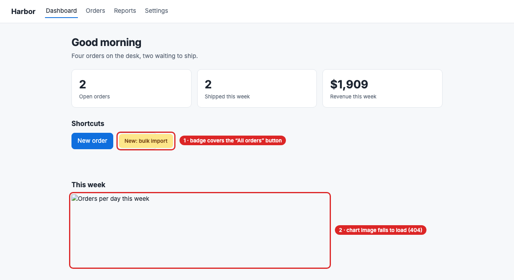
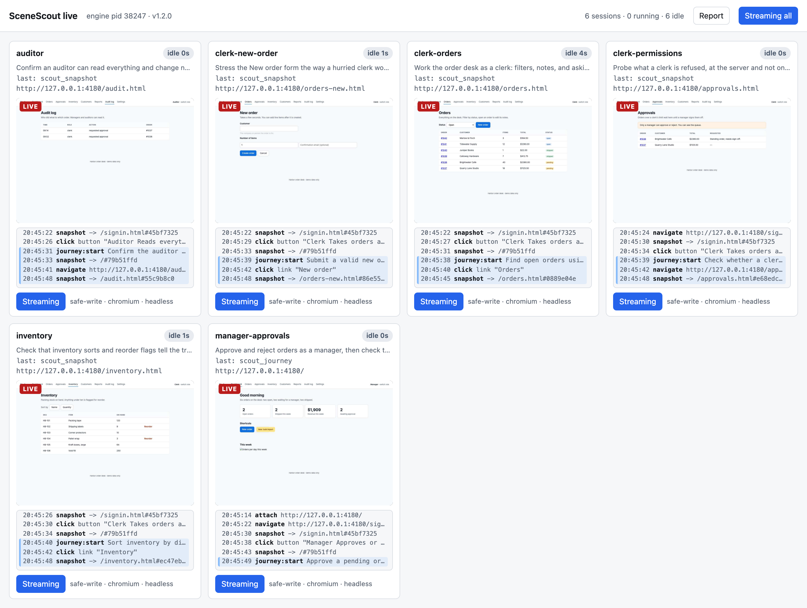
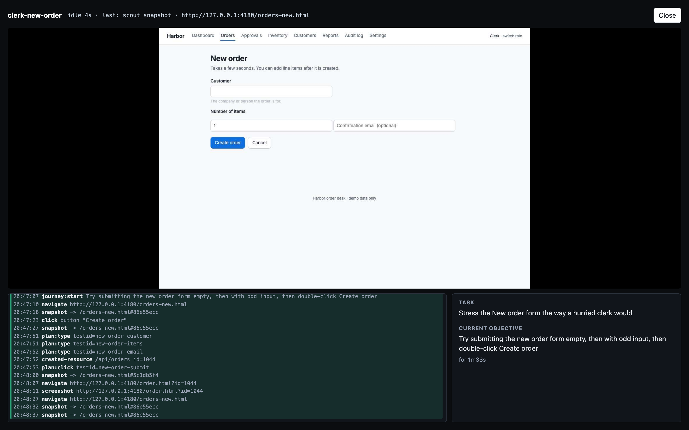
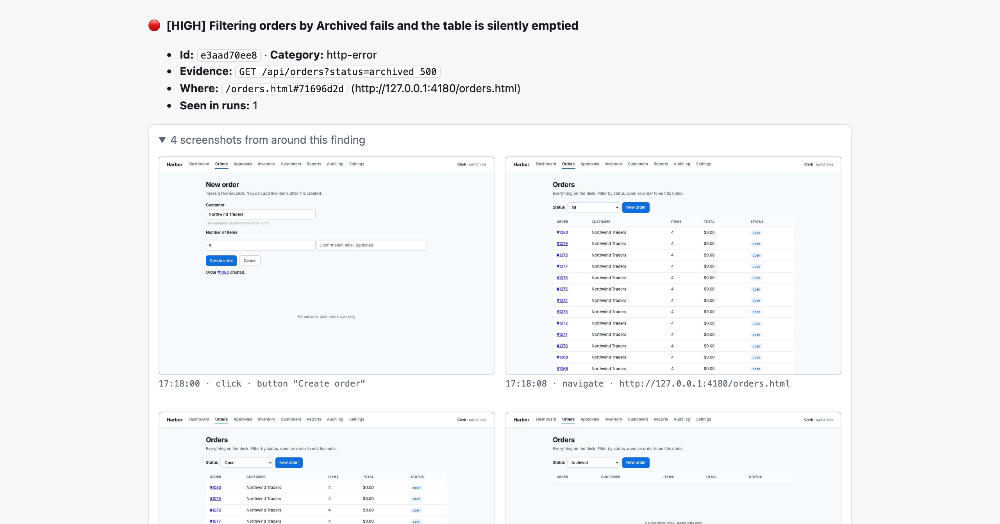
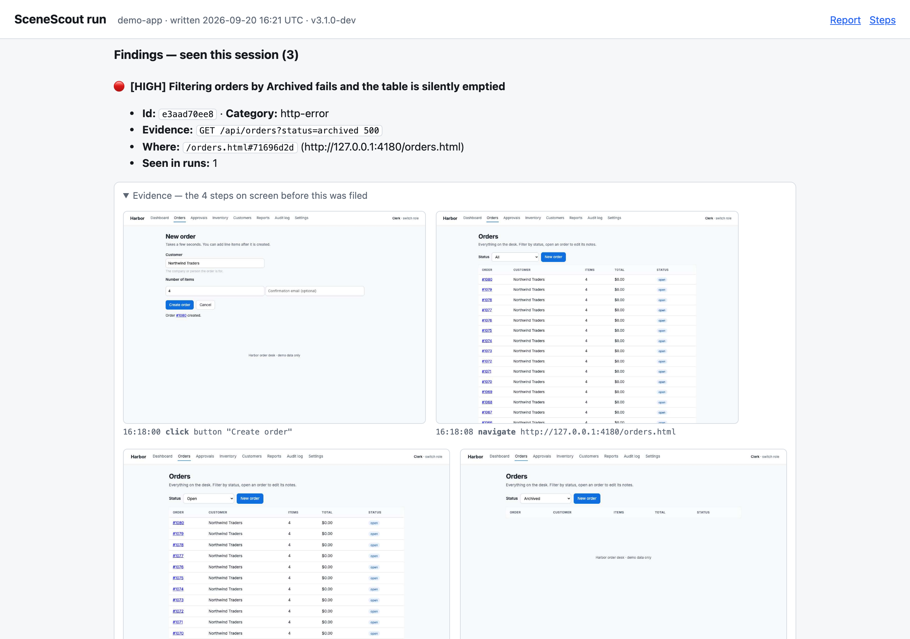

<div align="center">

# 🔭 SceneScout

**Exploratory UI testing, driven by the AI agent you already use.**

Works with Claude Code · Cursor · VS Code (Copilot) · Codex CLI · Gemini CLI · Copilot CLI · Windsurf · any [MCP](https://modelcontextprotocol.io) client

[](https://github.com/brunoboto96/SceneScout/actions/workflows/test.yml)
[](https://www.npmjs.com/package/scenescout)
[](LICENSE)


[👀 See it work](#-see-it-work) · [✨ Why](#-why-its-different) · [🎯 Two ways to use it](#-two-ways-to-use-it) · [🚀 Quickstart](#-quickstart) · [🧰 Toolbox](#-the-toolbox) · [🔌 Other clients](#-other-mcp-clients) · [🔒 Safety](#-safety-model) · [🩺 Troubleshooting](#-troubleshooting)

</div>

SceneScout is an [MCP](https://modelcontextprotocol.io) server that hands an agent a *structured view* of a running web app — every element, its geometry, and a set of always-on correctness oracles — and lets the agent explore it like a curious user. Your coding agent is the brain; SceneScout is the hands, eyes, and memory. Any MCP client can drive it, and the testing method comes with the server, so the agent knows how to use the tools wherever it runs.

```
┌─────────────────────┐   MCP (stdio)   ┌───────────────────────────────┐
│ Your coding agent   │ ──────────────▶ │ SceneScout engine             │
│ (intent, judgment,  │ ◀────────────── │ Playwright · oracles · memory │
│  your subscription) │  tool results   │ findings · report — no LLM    │
└─────────────────────┘                 └───────────────────────────────┘
```

Scripted E2E suites answer one question — *"does this exact flow still work?"* — and say nothing about the 95% of the app they don't touch. SceneScout covers both gaps: it finds what's **broken** (crashes, dead ends, permission leaks) *and* reports how the product could be **better** (confusing flows, weak hierarchy, design-system drift), with concrete measurements.


## 👀 See it work

This is a real run against the small demo app bundled in this repository. The app has bugs planted in it on purpose, and two of them are visible on its dashboard:

<p align="center"></p>

**The broken chart is the demo app's bug, not this page's** — it is one of the twelve findings SceneScout filed, next to the badge sitting on a button. The red callouts were added for this README; the [unmarked screenshots](examples/screenshots/) are the ones the engine took.

An excerpt of the report it wrote — [read the whole thing](examples/report.md):

> **🔴 [HIGH] A double-click on Create order creates two orders**
> Evidence: `2× click fired the same state-changing request 2× (POST /api/orders)`
> The submit button stays enabled while the request is in flight, and the endpoint accepts the repeat.
>
> **🔴 [HIGH] Filtering orders by Archived fails, and the page shows an empty table instead of an error**
> Evidence: `GET /api/orders?status=archived → HTTP 500`
>
> **🔴 [HIGH] A clerk can approve an order by calling the endpoint the page hides from them**
> Evidence: `POST /api/orders/1037/approve 200 as clerk; POST /api/orders/1038/reject 403 as clerk` — the button was hidden, the server did not agree.
>
> **🟠 [MEDIUM] The "New: bulk import" badge sits on top of the All orders button** *(callout 1)*
> Evidence: `"All orders" overlaps "New: bulk import" (81%)` — measured from layout boxes, no screenshot needed.
>
> **🟡 [LOW] The dashboard chart image is missing** *(callout 2)*
> Evidence: `GET /img/weekly-chart.png → HTTP 404`
>
> **Gap ledger — what was NOT tested:** 9/12 visited routes never design-audited · single-role run, so permission boundaries are untested

Every finding comes with a repro trace and a Playwright regression-test skeleton. To try it yourself, clone this repository, run `npm run demo:serve`, then `/scenescout --url http://127.0.0.1:4173` — see [demo-app/](demo-app/). Its README lists every seeded defect and which oracle catches it.

---

## ✨ Why it's different

- 🧠 **Your agent is the brain — no API key.** The engine contains no LLM. Exploration runs on the agent and subscription you already have (Claude Code, Cursor, Copilot, Codex, Gemini CLI and others); SceneScout just gives it deterministic tools and the method for using them.
- 📐 **Structured scene, not pixels.** The agent reads element lists *with layout geometry*, not screenshots. Overlap and off-screen bugs are computed from boxes — deterministic, no vision guessing. Images that failed to load are read from the DOM too. (Screenshots exist only for pixel-native residue like a canvas or a rendering glitch.)
- 🛡️ **Read-only by default, enforced on the wire.** Destructive actions are blocked at the network layer, not by asking the model nicely. Opt into writes only against disposable data.
- ✅ **Completion is a contract, not a vibe.** The engine knows the app's routes and *refuses* to file an "extensive" report while any known route is unvisited, unexercised, or un-audited. "Explored a bit and stopped" is structurally impossible.
- 🧭 **It remembers.** UI states are fingerprinted and stored in the project's `.scenescout/`. Run N+1 skips what run N already covered, and every run starts smarter than the last.

---

## 🎯 Two ways to use it

SceneScout needs only a URL. Give it the source code as well and it gets noticeably better.

| | 🏠 **Next to the codebase** *(recommended)* | 🌐 **Against a remote URL** |
|---|---|---|
| **You run it from** | the app's repository | any folder — an empty `qa/` directory is fine |
| **It plays the role of** | a developer-tester who can read the code | a black-box QA tester, like a person with a browser |
| **How it finds pages** | 📂 reads routes from the source **and** follows links: file-based routing (Next.js, SvelteKit, Nuxt) and router configuration written in code (React Router, Vue Router, Angular). Routes built at runtime are not seen | 🔗 follows same-origin links only — pages nothing links to, or on another subdomain, stay unknown |
| **"Did we cover everything?"** | checked against the routes found in source *plus* discovered links — an unvisited one blocks the report | checked against the pages it managed to discover |
| **Setup it figures out** | framework, dev command, saved Playwright logins (`playwright/.auth/`), whether the app uses `data-testid` | none — you pass the URL, and the path to a login state if the app needs one |
| **What a finding looks like** | the symptom, **plus** the file behind it and a suggested fix | the symptom, a repro trace, and a regression-test skeleton |
| **Typical target** | `localhost` while you build | staging, a preview deploy, a client's site |

**Why the codebase helps.** The agent driving SceneScout is a coding agent, which can already read your repository. With the source at hand it knows the app's static routes before opening the browser, so coverage is measured against the real app instead of whatever happened to be linked. It can also check a suspicion against the code before reporting it: "there is no way to export this table" is a much stronger finding once the agent has confirmed no export handler exists. And when something breaks it can open the component or handler responsible and tell you *where* and *how* to fix it — "the save button does nothing" becomes "`OrderForm` swallows the rejected promise in `onSubmit`; surface the error and re-enable the button".

**Why it still works without it.** Everything SceneScout *observes* comes from the running page — elements, layout geometry, console and network errors, design-audit scores, task-ease measurements — and none of that needs source code. Point it at a URL you are allowed to test and it behaves like a thorough QA tester: it explores, reproduces, and files findings with evidence.

```
# next to the code — run inside the app's repository
/scenescout --url http://localhost:3000

# remote — run from any folder; memory and the report are kept there
/scenescout --url https://staging.example.com --role ./auth/qa.json
```

> [!IMPORTANT]
> Only test sites you own or are authorized to test. A remote environment is more likely to hold real data, so for a remote URL with no source the skill attaches in **`observe`** mode: nothing but `GET` requests leaves the page. The default **read-only** mode blocks `PUT`/`PATCH`/`DELETE` and destructive-looking requests, but an ordinary form submission (a plain `POST`: contact form, comment, order, signup) still reaches the server and can create a record. Say so when that is acceptable on your target. See the [safety model](#-safety-model).

---

## 🚀 Quickstart

### 📦 Prerequisites

| | |
|---|---|
| **Node** | ≥ 20 |
| **An MCP client** | Claude Code, Cursor, VS Code with Copilot, Codex CLI, Gemini CLI, GitHub Copilot CLI, Windsurf, or [any other](#-other-mcp-clients) |
| **A web app to test** | SceneScout tests a *live* app: start yours locally first (e.g. `npm run dev`, `make dev-up`), or have the URL of a deployed one you're allowed to test |

### 1️⃣ Install

It is on npm. Nothing to clone:

```bash
npx -y scenescout install                      # Claude Code: skill + server + Chromium (one-time download)
npx -y scenescout install --client cursor      # or: vscode, codex, gemini, copilot, windsurf (comma-separated for several)
```

Either way it downloads the browser and registers the server with the client you named. Claude Code also gets the method as a skill; every other client receives the same method from the server. [What each client gets](#-other-mcp-clients).

**Prefer a Claude Code plugin?** The skill and the server arrive together:

```
/plugin marketplace add brunoboto96/SceneScout
/plugin install scenescout@scenescout-marketplace
```

Then download the browser once with `npx -y scenescout install --browser-only`. The command becomes `/scenescout:scenescout`. A plugin's skill comes from this repository and its server from the latest npm release, so right after a release lands here the two can differ for a short while; `/plugin marketplace update scenescout-marketplace` brings the skill up to date.

**A client that is not in that list?** Run `npx -y scenescout install --browser-only` and [add the server to its config by hand](#-other-mcp-clients).

<details>
<summary>What <code>install</code> actually does</summary>

1. puts the `/scenescout` skill into `~/.claude/skills/` (or `$CLAUDE_CONFIG_DIR/skills/`) — a `scenescout` folder it didn't create is moved aside to a `.backup-…` copy, never deleted,
2. downloads the browser SceneScout drives (skipped if you already have it). By default that is Chromium, as two builds: the full browser for headed runs and the headless shell every other run uses. [Choose something else](#-choosing-browsers) with `--browsers`,
3. registers the MCP server with Claude Code at user scope. Run through `npx`, the launcher is `npx -y scenescout serve`, with the absolute path of `npx` where one sits beside node, so it works under nvm/fnm. From a clone or a global install it is the absolute node path plus that install's `dist/mcp-server.js`,
4. puts the `scenescout` command on your PATH, so `scenescout status`, `scenescout watch` and `scenescout doctor` work from any terminal. Run through `npx`, that is `npm install -g` of the version you just ran; from a clone it is `npm link`, so the command always runs what you last built. If npm refuses (a system-wide node usually needs `sudo` for this), the step prints the command to run by hand and the rest of the setup still counts as done: `npx -y scenescout <command>` works without it.

Re-run it any time: after moving the folder or switching node versions it refreshes the stored paths. It exits non-zero if a step the tool depends on failed, so it is safe to chain. Opt out of a step with `--no-register`, `--skip-browser` or `--no-command`.

If `claude` isn't on the PATH of the shell you ran it from, it prints the registration command instead of running it:

```bash
claude mcp add --scope user scenescout -- npx -y scenescout serve
```

</details>

### 2️⃣ Check it

```bash
npx -y scenescout doctor --engine   # any client: node + build + browser
npx -y scenescout doctor            # Claude Code: the above, plus the skill and the registration
```

Every line should be a ✓. Anything that isn't prints the exact command that fixes it. Then **start a fresh session** in your client so it picks up the new tools.

### 3️⃣ Run it

No app handy? Clone this repository and run `npm run demo:serve`: the [demo app](demo-app/) starts on `http://127.0.0.1:4173`.

Open your agent inside the project you want to test (or, for a [remote URL](#-two-ways-to-use-it), any folder) and ask:

```
Use SceneScout to test http://localhost:3000 at medium level
```

In Claude Code the skill gives you a command with flags for the same thing:

```
/scenescout --level medium --url http://localhost:3000 --role qa
```

The agent scans the project (if there is one), attaches read-only, explores, and writes findings to `.scenescout/report.md`. That's it.

**Common flags** — `--level minimal|medium|extensive` · `--url <app>` · `--role <name\|path>` (a Playwright storage-state to explore as: a name found by the scan, or a path to the JSON file) · `--observe` / `--safe-write` / `--allow-destructive`.

---

## 📺 Watching a run live

When a session attaches, the engine starts a small live view and hands the agent its address on a `Live view:` line, which the agent passes on to you. From a terminal, `scenescout watch` opens the same page. There is one card per session:

<p align="center"></p>

- **What it is doing:** the tool it is running and for how long, the page it is on, and a thumbnail of that page. This works for headless runs too, which have no window to look at.
- **What it just did:** a rolling feed of its actions, each with its target and how it turned out, with failures in red. It is the same trail a finding's repro trace uses. The engine never sees the agent's reasoning, so this is what the session *did*, not what it thought.
- **Stuck, not slow:** a call still running past its own tool's watchdog budget turns the card red, so a wedged session is visible without asking. A crawl legitimately runs for minutes; it is judged against the crawl's budget, not a click's.
- **Live stream:** switch it on for one card, or for all of them. Click a thumbnail for a close-up.
- **The report, as it stands:** the Report button in the top bar shows the same document `scout_report` writes at the end, rendered from the run's current state, so findings can be read while the agents are still working.
- **What it is for:** the close-up puts the feed beside the session's brief — the objective it was given when it attached (`scout_attach {objective}`), and underneath it the task it is on right now (`scout_task`), which the engine requires before any tool will act. Each task tints its own block of actions, so a change of task is a change of colour; point at a block and the brief names the task those actions served.
- **Scrub it back:** under the page is a tick per action, coloured by task. Click one to see the frame from that moment, and `Back to live` to return. On a run that was not recorded the ticks still read the trail; they just have no picture behind them.

<p align="center"></p>

<p align="center"></p>

The view is served on `127.0.0.1` only, behind a token that changes every time the engine starts. It answers `GET` and nothing else, so a viewer can watch a run but not act in it, and no frame it shows is written to disk ([ADR 7](docs/adr/0007-the-live-view-is-local-read-only-and-leaves-nothing-behind.md)) unless the run was recorded, which is asked for and off by default ([ADR 8](docs/adr/0008-a-recorded-run-is-evidence-and-must-be-asked-for.md)). A stream runs only while someone is watching it. `SCENESCOUT_LIVE=off` keeps the port closed.

**Try it with parallel agents.** The demo app has three roles and several separate areas, so a run can be split between agents. Start it with `npm run demo:serve`, then ask your agent to explore it with several agents in parallel, one role and one area each. The pictures above come from a run of three. Two things keep a parallel run efficient:

- **Each agent opens its own session when it starts, and the planner closes it once it has folded that agent's report.** An agent waiting for its turn then holds no browser. Opening every session up front leaves browsers idling while the machine runs out of memory for the agents that are working. Closing before the fold loses the lane's decisions, which have nowhere to be kept.
- **Slow it down to follow along.** `scout_attach {paceMs}` (or `scout_session {paceMs}` mid-run) sets a floor between actions, for when you want to watch a flow rather than let it run as fast as the page allows.
- **Run about as many agents at once as your machine has cores, less two.** Each one drives a real browser.

---

## 🎬 Recording a run, and reading it back

A report says what happened. For QA work that is not always enough — the point
is often to *show* what was checked, not to assert it. Ask for a recorded run
and the engine keeps a frame of the page after every action:

```
Use SceneScout to test http://localhost:3000, record the run
```

or, on the tool directly, `scout_attach {record: true}`.

Then `scout_report` writes two files side by side in `.scenescout/`:
`report.md` as always, and `report.html` — the whole run as one self-contained
page. It opens from the file system with nothing running, needs no network, and
holds:

- **The report**, rendered from the same Markdown.
- **The screenshots around each finding**, in an accordion under it, from the
  session that filed it.
- **Every session's trail**, in the blocks its tasks made, each step with the
  page as it was at that moment.

<p align="center"></p>

The live view serves the same document at `run` while the engine is still up,
and sends you there when the run ends — so the address survives a refresh
instead of a panel over a dead board.

**What it costs.** Frames are pictures of the app under test, inside the tested
project's folder, and the secret redaction that protects everything else the
engine writes cannot read a picture. That is why it is off unless asked for,
capped per session, and written only under `.scenescout/`, which ignores itself
so `git add -A` in the tested project cannot pick the frames up. The reasoning is in
[ADR 8](docs/adr/0008-a-recorded-run-is-evidence-and-must-be-asked-for.md).

---

## 🔄 How a run works

One curiosity loop, repeated — breadth first, then judgment where it matters:

```
scan ──▶ attach ──▶ crawl ──▶ investigate ──▶ measure ──▶ report
 │         │          │            │              │           │
routes   browser   every route  reproduce &   journeys +   gap-checked
& auth   (r/o)     in ONE call   file findings  design audit  markdown
```

1. **Scan** the project — framework, routes, auth states.
2. **Attach** a browser (read-only unless you said otherwise).
3. **Crawl** every known route in a *single* call — per-route HTTP status, element counts, oracle violations, dead ends.
4. **Investigate** what the crawl flagged: navigate, snapshot, reproduce, file a structured finding.
5. **Measure** task ease (`scout_journey`) and design quality (`scout_design_audit`) on representative pages.
6. **Report** — the engine checks the gap ledger and writes `.scenescout/report.md`.

Snapshots are cheap: re-snapshotting a route returns only *what changed*, with stable refs (measured on a 130-element page: 10.7 kB → 0.7 kB).

---

## 🧰 The toolbox

29 deterministic tools. The agent picks; you rarely call these by hand.

| Phase | Tools | What they do |
|---|---|---|
| **Set up** | `scout_playbook` `scout_scan` `scout_attach` `scout_session` | Hand the testing method to an agent that has no skill loaded; discover routes; launch a browser in a write-mode; keep several authenticated roles alive at once |
| **Explore** | `scout_crawl` `scout_coverage` | Sweep every route in one call; ask what's still untested |
| **Look** | `scout_snapshot` `scout_hover` `scout_screenshot` | Read the structured scene (diffed); reveal tooltips/hover cards; capture pixels only when needed |
| **Ask the server** | `scout_request` | Call the app's own API as this session, with the UI bypassed — the check that turns a hidden button into a proven refusal |
| **Act** | `scout_click` `scout_type` `scout_select` `scout_upload` `scout_press` `scout_scroll` `scout_navigate` `scout_back` `scout_run_plan` | Drive the UI like a user; `scout_run_plan` batches a whole mechanical sequence into one call |
| **Assess** | `scout_design_audit` `scout_journey` | Score a page's craft/a11y/consistency; measure how hard a task is to complete |
| **Record** | `scout_note` `scout_finding` `scout_resolve` `scout_report` | Curate durable notes; file deduped findings; mark fixes; write the report, and on a recorded run the whole run as one page |
| **Re-test** | `scout_verify` | List the findings earlier runs left open, worst route first, and record whether each is gone, still present, or changed |
| **Split the work** | `scout_lane_brief` `scout_lane_report` | Divide the app between parallel agents by whole module, each with its own landing route and rules; fold what each hands back as one typed JSON object, and name any defect it judged but never filed |
| **Close** | `scout_close` | Tear down one session or all |

A few that punch above their weight:

- **`scout_crawl`** — the entire breadth pass in one tool call. No visiting routes one-by-one.
- **`scout_run_plan`** — up to 20 actions (fill form → submit → check) with semantic targets (`testid=…`, `text=…`), aborting at the first anomaly.
- **`scout_journey`** — wraps one goal and reports interaction count, screens seen, and **backtracks**; an abandoned journey is a finding no passing E2E suite can produce.
- **`scout_upload`** — generates a *valid* in-memory fixture (real PDF/PNG, kind inferred from `accept`) so file-upload flows stop being a blind spot.
- **`scout_click {clicks: 2}`** — the impatient-user probe: states whether a double-click fired the same state-changing request twice (the classic double-submit bug).
- **`scout_request`** — calls the app's own API as the session, so "the button is hidden" becomes "the server refuses it" (or doesn't).

Beyond crashes and HTTP errors, two oracles catch a page **contradicting the server**: `refused_empty` (a list request was refused and the page shows its empty state with no error) and `false_success` (a save was refused and the page says it worked). A third, `dom_injection`, reports a typed markup value coming back as an element on any page any session opens.

---

## 📊 Test levels

Each level is an **enforced contract** — `scout_report` checks it before finalizing.

| Level | What it guarantees | Rough size |
|---|---|---|
| `minimal` | Every route visited, ≥1 design audit, key journeys as plans, crawl problems triaged. Remaining gaps **disclosed**. | ~40 actions |
| `medium` *(default)* | minimal + design audits across several routes + every element class exercised + every form submitted valid **and** invalid | ~150 actions |
| `extensive` | medium + fuzzing, back/refresh/deep-link resilience, keyboard-only pass, a journey per module, ≥2 roles compared, anonymous auth-surface walk. **Refuses to finalize while any gap remains.** | budget-capped |

That refusal *is* the guarantee: an extensive report can only exist when nothing known was left untested.

---

## 🔒 Safety model

- 🔵 **`observe`** (`--observe`) lets nothing but `GET` requests leave the page. The one exception is what a session needs in order to exist: logging in, logging out and refreshing a token. Signing up, changing or resetting a password and creating users are blocked like any other write. WebSocket frames are not inspected; the engine says so when the app opens a socket. It is what the skill picks for a remote URL with no source, where an ordinary form POST would create a real record. Forms that could not be submitted are listed in the gap ledger.
- 🟢 **`read-only` by default.** Destructive-labeled elements (delete/revoke/archive/…) **and** all `PUT/PATCH/DELETE` + destructive `POST`s are blocked at the network layer — see [`src/engine/policy.ts`](src/engine/policy.ts). Non-destructive `POST`s are allowed, because submitting forms is how a tester finds validation bugs — so read-only means *nothing existing is changed or removed*, not *nothing is ever created*.
- 🟡 **`safe-write`** (`--safe-write`) lets the agent create data and edit/delete **only what it created** this run — never pre-existing records.
- 🔴 **`destructive`** (`--allow-destructive`) allows everything, and only ever when *you* confirm the environment is disposable. The skill will never choose this itself.
- 📂 Findings, memory, and reports live in a `.scenescout/` folder where you ran it. It ignores itself in git, so a stray `git add -A` never commits test data.

A `🛡 WRITE-POLICY blocked` notice is the safety net doing its job, not an app bug.

---

## 📋 What you get

`.scenescout/report.md` — a deduplicated, worst-first report with:

- 🐛 **Findings** with repro traces and generated Playwright regression-test skeletons.
- 💯 **Page scores** (0–100: a11y · craft · consistency · task-clarity), ranked worst-first, with stale scores from old runs marked as such.
- 👥 **A role capability matrix** — what each role could and couldn't reach.
- 🧾 **A gap ledger** — everything *not* done, so the report is honest about its own coverage.
- ⏱️ **How the run was paced** — actions, median gap, idle share and held-idle time per session, so a browser held open for nothing is visible.
- 🎯 **How well the lanes judged** — on a parallel run, whether the confidence each lane stated matched what the project went on to file, beside what later re-tests found ([ADR 10](docs/adr/0010-a-confidence-is-checked-not-trusted.md)).

`.scenescout/report.html` — the same report as one self-contained page, with every session's trail beside it, and on a [recorded run](#-recording-a-run-and-reading-it-back) the screenshots under each finding.

👀 Watch a run live: `node dist/cli.js status <project-path>`.

---

## 🩺 Troubleshooting

Run `npx -y scenescout doctor` first — it checks every setup item below (everything but the last row, which is about your app) and prints the fix.

| Symptom | Cause and fix |
|---|---|
| `/scenescout` isn't a known command | The skill isn't linked, or the session predates it. `npx -y scenescout install`, then start a **fresh** Claude Code session. |
| The `scout_*` tools don't appear | The MCP server isn't registered, or points at an old path. `npx -y scenescout install` re-registers it; `claude mcp list` should show `scenescout` as connected. |
| *"Executable not found in $PATH"* | The server was registered with a bare `node`. `npx -y scenescout install` registers an absolute path. |
| Installed as a plugin, and the tools fail with *"Executable not found in $PATH: npx"* | A plugin starts the server with a bare `npx`, which Claude Code can only find if it was launched from an environment that has Node on its `PATH`. Under nvm or fnm that means starting Claude Code from a terminal, not from a dock or launcher. Or use `npx -y scenescout install` instead, which registers the absolute path of `npx`. |
| *"… build has not been downloaded yet"* on attach | The browser download was skipped or failed, or the run asked for a browser you did not install. Run the command the message names, for example `npx -y scenescout install --browser-only --browsers firefox`. On Linux, system libraries may be missing too: `npx playwright install --with-deps chromium`. |
| Tools broke after moving the folder or changing node version | The registration stores absolute paths. `npx -y scenescout install` refreshes them. |
| Attach fails or every route lands on the login page | Your app isn't running at `--url`, or the `--role` storage state has expired — regenerate it the way your project's Playwright setup does. |

### ⬆️ Upgrading from an older version

- **Tools are now `scout_*`.** Up to v0.23 they were prefixed `ft_`. The rename happened before the first npm release, with no aliases, so an agent's context carries one tool list rather than two. Re-run `npx -y scenescout install` so the installed skill matches the server.
- **Earlier names.** This tool was previously called SceneCraft (and, before that, frontend-tester). `scenescout install` cleans up after both: it removes the old skill link and the old `scenecraft` MCP registration when they point at this install, and the first attach in a project moves its `.scenecraft/` memory folder to `.scenescout/` so earlier coverage and findings carry over.

### 🧹 Uninstall

```bash
# Claude Code
claude mcp remove --scope user scenescout
rm -rf ~/.claude/skills/scenescout
# Codex / Gemini / Copilot CLI
codex mcp remove scenescout        # likewise: gemini mcp remove …, copilot mcp remove …
```

For Cursor, Windsurf and VS Code, delete the `scenescout` entry from the client's MCP server list.

Nothing else is installed: `npx` runs the package from npm's cache. Per-project memory lives in each tested project's `.scenescout/` folder; delete it there if you want it gone.

---

## 🌐 Choosing browsers

`install` downloads Chromium and nothing else unless you ask. `--browsers` takes one name, a comma-separated list, or `all`:

| `--browsers` | What is downloaded | About, on disk |
|---|---|---|
| `chromium` *(default)* | the full browser and the headless shell | 550 MB |
| `chromium-headless-shell` | the headless shell only: every run works except `headed` | 200 MB |
| `firefox` | Firefox | 270 MB |
| `webkit` | WebKit, the engine behind Safari | 290 MB |
| `all` | Chromium, Firefox and WebKit | 1.1 GB |

```bash
npx -y scenescout install --browsers chromium-headless-shell   # the smallest working setup
npx -y scenescout install --browser-only --browsers firefox,webkit   # add two more later
```

Sizes vary by platform. The builds go to Playwright's shared cache, so a build another tool already fetched is not downloaded again.

To drive another browser, pass `browser` when attaching (`scout_attach { browser: "firefox" }`), or set `SCENESCOUT_BROWSER=webkit` in the server's environment to change the default. `scenescout doctor` checks the browser named by that variable in the shell it runs from, so check another one with `SCENESCOUT_BROWSER=webkit scenescout doctor`. Two things differ outside Chromium:

- **Service workers are not allowed to register** in Firefox and WebKit. The write policy works by intercepting requests, and only Chromium lets a request issued by a service worker be intercepted. An app that depends on its worker may behave differently there.
- **A Firefox or WebKit left behind by a crash is not cleaned up** on the next start the way a leftover Chromium is.

In every browser, pages are not given shared workers unless the mode is `destructive`: a request a shared worker sends cannot be intercepted anywhere, so the app is made to do that work on the page, where the policy sees it.

## 🔌 Other MCP clients

The engine is a plain MCP server over stdio, so any client can drive it, and the testing method reaches the agent through the server itself (see the end of this section). `install` can register it for you:

```bash
npx -y scenescout install --client cursor            # one client
npx -y scenescout install --client vscode,codex      # several; add claude-code to keep that one too
```

| `--client` | How it is registered |
|---|---|
| `claude-code` *(default)* | `claude mcp add`, plus the skill |
| `cursor` | adds an entry to `~/.cursor/mcp.json`, keeping the others |
| `vscode` | VS Code's own `code --add-mcp`. A `code` command that belongs to another editor is not used |
| `codex` | `codex mcp add` |
| `gemini` | `gemini mcp add --scope user` |
| `copilot` | `copilot mcp add` (GitHub Copilot CLI) |
| `windsurf` | adds an entry to `~/.codeium/windsurf/mcp_config.json`, keeping the others |

A config file that is not valid JSON is left untouched, and the entry to add by hand is printed instead; a config that is a link into a dotfiles repository is written through the link. When a client that is registered through its own command is not installed, `install` says so and prints the command to run later. Cursor and Windsurf are files, so their entry is written whether or not the editor is installed yet. On Windows, a client installed through npm is a `.cmd` shim that `install` cannot start; it prints the command for you to run instead. Then restart the client and ask its agent: *"Use SceneScout to test http://localhost:3000"*.

What has been checked: registering through each command above was run against Codex CLI, Gemini CLI, GitHub Copilot CLI and VS Code, and Cursor's command line agent read the entry `install` wrote, connected and listed the tools. The Windsurf path follows its documentation. A full test session has been run in Claude Code, with and without the skill. If a client behaves differently for you, a correction is welcome (say which client version you checked).

To register by hand instead, the server entry is always the same command, `npx -y scenescout serve`:

<details>
<summary><strong>Cursor</strong> — <code>~/.cursor/mcp.json</code> (or <code>.cursor/mcp.json</code> in a project)</summary>

```json
{
  "mcpServers": {
    "scenescout": { "command": "npx", "args": ["-y", "scenescout", "serve"] }
  }
}
```

</details>

<details>
<summary><strong>VS Code</strong> (GitHub Copilot agent mode) — <code>.vscode/mcp.json</code></summary>

```json
{
  "servers": {
    "scenescout": { "type": "stdio", "command": "npx", "args": ["-y", "scenescout", "serve"] }
  }
}
```

</details>

<details>
<summary><strong>Codex CLI</strong> — <code>~/.codex/config.toml</code></summary>

```toml
[mcp_servers.scenescout]
command = "npx"
args = ["-y", "scenescout", "serve"]
```

</details>

<details>
<summary><strong>Gemini CLI</strong> — <code>~/.gemini/settings.json</code> (or <code>.gemini/settings.json</code> in a project)</summary>

```json
{
  "mcpServers": {
    "scenescout": { "command": "npx", "args": ["-y", "scenescout", "serve"] }
  }
}
```

</details>

<details>
<summary><strong>Windsurf</strong> — <code>~/.codeium/windsurf/mcp_config.json</code></summary>

```json
{
  "mcpServers": {
    "scenescout": { "command": "npx", "args": ["-y", "scenescout", "serve"] }
  }
}
```

</details>

<details>
<summary><strong>Cline</strong> — MCP Servers → Configure → Configure MCP Servers (or <code>~/.cline/mcp.json</code> for the CLI)</summary>

```json
{
  "mcpServers": {
    "scenescout": { "command": "npx", "args": ["-y", "scenescout", "serve"], "disabled": false, "autoApprove": [] }
  }
}
```

</details>

<details>
<summary><strong>Zed</strong> — <code>settings.json</code> (command palette: <code>zed: open settings file</code>)</summary>

```json
{
  "context_servers": {
    "scenescout": { "command": "npx", "args": ["-y", "scenescout", "serve"], "env": {} }
  }
}
```

</details>

<details>
<summary><strong>Anything else</strong></summary>

Most clients accept the same `mcpServers` JSON shape shown for Cursor.

</details>

**The method travels with the server.** The tools are only hands and eyes; [`skills/scenescout/SKILL.md`](skills/scenescout/SKILL.md) is the method: what to look at first, when to stop, what counts as a finding. Claude Code loads it as a skill. Every other client gets the same text from the server, with nothing to copy:

- the server's instructions tell the agent to call `scout_playbook` before its first attach, and that tool returns the method,
- clients that list server prompts as commands also get an `explore` prompt, which loads the method and takes an optional URL, level and focus.

So in any client, a first message like *"Use SceneScout to test http://localhost:3000"* is enough. If an agent starts clicking without having called `scout_playbook`, tell it to call that first; how closely a model follows server instructions varies by client.

The CLI is also useful on its own:

```bash
npx -y scenescout scan <path>       # project discovery: framework, routes, saved logins
npx -y scenescout status <path>     # what every session of a running engine is doing right now
npx -y scenescout watch <path>      # the same, live in your browser, with each session's page
```

---

## 📁 Project layout

```
src/
  mcp-server.ts     the 29 tools + per-session dispatch
  scan.ts           project discovery (framework, routes, auth)
  cli.ts            scan · serve · install · doctor · status
  installer.ts      setup logic (skill link, MCP registration, diagnostics)
  engine/
    browser.ts      the engine class: attach, snapshot, actions, crawl, plans
    probes.ts       in-page scroll + overlay + focus probes (needs a browser too)
    fingerprint.ts  route + element-set identity (state hashing)
    oracles.ts      console/page/network/HTTP error detection
    injection.ts    the DOM-injection oracle's rules (what to watch for, how to find it)
    claims.ts       when the page contradicts the server (refused_empty, false_success)
    request.ts      what a replayed API call may be and where it may go
    brief.ts        splitting the app between parallel lanes
    lane.ts         the typed report a lane hands back
    calibration.ts  whether a lane's confidence held up; what it judged and never filed
    pace.ts         how a run spent its time
    bench.ts        scoring a run against the demo app's answer key
    policy.ts       the write-policy safety net
    ownership.ts    safe-write: which records did this run create?
    uploads.ts      disk uploads, fenced to the project by real path
    journey.ts      task-ease measurement from the action log
    design.ts       the design audit + page scoring
    memory.ts       cross-run storage + finding dedup
    report.ts       the gap ledger + report generation
    replay.ts       the run as one page: steps, tasks, frames under each finding
    …               collector · dispatch · fixtures · authloss · reaper
scripts/            the 23 test suites (smoke/ holds the real-browser ones)
test-app/           fixtures for the real-browser smoke tests
skills/scenescout/   the testing method (SKILL.md): a skill in Claude Code, served by the server everywhere else
docs/how-it-works.md  what happens at each stage, in diagrams
docs/benchmark.md   measuring whether a change made runs better
docs/adr/           why it's built this way
```

> Design principle: logic that *doesn't* need Playwright lives outside `browser.ts`, so it can be unit-tested without launching a browser. That's why `fingerprint`, `policy`, `memory`, `report`, etc. are their own modules.

---

## 🧠 Design decisions

**[How it works, stage by stage](docs/how-it-works.md)** — diagrams of the run lifecycle, what happens inside one action, the write policy on the wire, how a violation becomes a finding, how a parallel run is split and folded, how roles hand work to each other, where a run's time goes, and how a lane's confidence is checked afterwards.

**[Measuring whether a change helped](docs/benchmark.md)** — the demo app's answer key, the scorecard (recall, precision, judged-not-filed, severity, calibration), and the results log of every run, including what did not help.

The load-bearing choices are recorded as ADRs — read the relevant one before changing a rule it covers:

- [1 · Completion is an enforced contract, not a claim](docs/adr/0001-completion-is-a-contract-not-a-vibe.md)
- [2 · The write policy is enforced on the wire, not in the prompt](docs/adr/0002-enforce-the-write-policy-at-the-network-layer.md)
- [3 · A gap-ledger entry must be actionable, and suppression must be visible](docs/adr/0003-a-noisy-ledger-is-a-broken-ledger.md)
- [4 · Findings dedup on machine signals, and a merge must never lose a finding](docs/adr/0004-dedup-on-machine-signals-not-prose.md)
- [5 · Testable logic lives outside `browser.ts`](docs/adr/0005-keep-testable-logic-out-of-the-browser-module.md)
- [6 · Nothing in this repo names or is tuned for a tested app](docs/adr/0006-stay-project-agnostic.md)
- [7 · The live view is local, read-only, and leaves nothing behind](docs/adr/0007-the-live-view-is-local-read-only-and-leaves-nothing-behind.md)
- [8 · Recording is opt-in, and a recorded run is one self-contained page](docs/adr/0008-a-recorded-run-is-evidence-and-must-be-asked-for.md)
- [9 · A refused write is answered, not dropped](docs/adr/0009-a-refused-write-is-answered-not-dropped.md)
- [10 · A lane's confidence is checked, not trusted](docs/adr/0010-a-confidence-is-checked-not-trusted.md)

---

## 🔧 Development

Working on SceneScout itself is the only reason to clone it:

```bash
git clone https://github.com/brunoboto96/SceneScout.git scenescout && cd scenescout
npm install        # installs dependencies and builds
npm run setup      # same as `scenescout install`, but registers THIS checkout (the skill is linked, so edits are live)
npm test           # build + 23 suites: 21 pure-logic suites (scan, oracle, policy, … bench, hygiene),
                   #                     then smoke (real browsers) and mcp-check (the server over stdio)
npm run bench -- --all   # re-score every archived benchmark run against the current answer key
npm run demo       # regenerate examples/ from the demo app
```

Contributing? Start with [VISION.md](VISION.md) (what is in scope) and [CONTRIBUTING.md](CONTRIBUTING.md) (how changes land), then see [AGENTS.md](AGENTS.md) for the house rules — chiefly: bug fixes need a regression test at the cheapest layer that can fail, keep the repo project-agnostic (ADR 6), and `npm test` must pass.

## 🔐 Security

Found a way past the write policy, or another security problem? Please report it privately — see [SECURITY.md](SECURITY.md).

## 📄 License

[MIT](LICENSE).

<details>
<summary><strong>Full capability list</strong> — every behavior, for the curious</summary>

- **Structured render-state, not pixels.** Element lists with geometry; screenshots reserved for pixel-native residue (canvas, rendering glitches). Images that failed to load are reported from the DOM, including ones whose URL answered 200 with something that is not an image.
- **Diff snapshots with stable refs.** Re-snapshots return only what changed (10.7 kB → 0.7 kB on a 130-element page); old refs stay valid.
- **Geometry oracles.** Overlap and off-screen defects computed from layout boxes.
- **Oracles after every action.** Console errors, page errors, failed requests, HTTP 4xx/5xx drained into every tool result — and DOM injection: a markup-shaped value the agent typed that later renders as an element on any page (stored or reflected XSS).
- **Multi-role, genuinely concurrent.** Commands to *different* sessions run in parallel; safe-write ownership is shared, so role A can create what role B approves. The report renders a role capability matrix.
- **Task ease, not just correctness.** `scout_journey` measures interaction cost, distinct screens, path, and backtracks.
- **Design audit with page scores.** Two tiers (⚠ measurable defects / → craft suggestions incl. AI-slop tells), per-page 0–100 score persisted per route, plus an automatic overlay/modal probe on every snapshot. Shared shell scored once, separately.
- **Scrolls like a user — and notices when it can't.** Reports `SCROLL LOCKED` for a leaked modal scroll-lock, finds the real inner scroll pane on app-shell layouts, and flags `UNREACHABLE` controls clipped inside `overflow:hidden`.
- **Uploads like a user.** Answers a styled file-chooser or sets a hidden input directly, with a valid in-memory fixture; `filePath` is fenced to the project under test; files violating `accept` are flagged at selection.
- **Auth via Playwright storage states.** Expired tokens caught at attach; repeated login-bounces raise `SESSION AUTH LOST`; a bounced route is recorded as *not* covered — a dead session can't certify routes it never reached.
- **A trustworthy gap ledger.** Entries must be actionable (a search box or wizard sub-step isn't "form filled but never submitted"); API/download URLs never enter the route contract.
- **Honest reporting.** Shared chrome counted once, stale scores marked, role matrix compares only roles that actually attempted a route.
- **Cross-run written knowledge.** `scout_note` curates `.scenescout/ASSUMPTIONS.md` — app model, personas, constraints, risks — in prose.
- **Daemon-grade robustness.** Per-tool watchdogs, orphaned-browser reaping, bounded teardown, live status via `scenescout status <project>`, and a live view of every session's page: the agent gives you its address when it attaches, or run `scenescout watch <project>` (loopback only, read-only, nothing written to disk: [ADR 7](docs/adr/0007-the-live-view-is-local-read-only-and-leaves-nothing-behind.md)).

</details>
