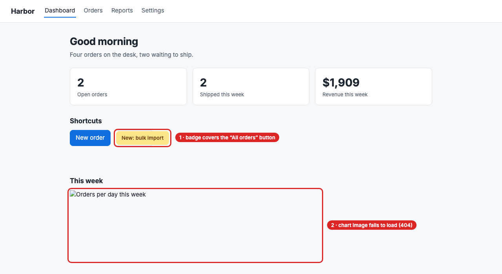
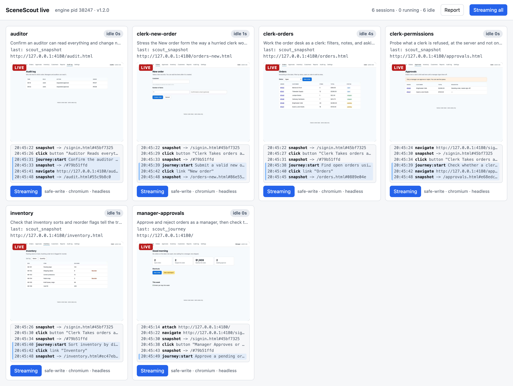

<div align="center">

# 🔭 SceneScout

**Your coding agent, turned into an exploratory QA tester for any web app.**

Works with Claude Code · Cursor · VS Code (Copilot) · Codex CLI · Gemini CLI · Copilot CLI · Windsurf · any [MCP](https://modelcontextprotocol.io) client

[](https://github.com/brunoboto96/SceneScout/actions/workflows/test.yml)
[](https://www.npmjs.com/package/scenescout)
[](LICENSE)


[📖 Guide](docs/guide/Home.md) · [🐛 What it catches](#-what-it-catches) · [🚀 Get started](#-get-started) · [🚦 CI](#-in-ci) · [🔒 Safety](#-safe-by-default) · [📚 Docs](#-documentation)

</div>

Scripted end-to-end tests answer one question: *does this exact flow still work?* They say nothing about the rest of the app. SceneScout lets the agent you already use explore a running web app like a curious, thorough tester. It clicks, fills forms, switches roles and calls the API behind a hidden button, then writes a report of what is **broken** and what could be **better**, with evidence for every line.

Try it on any app you are allowed to test. No account, no API key, no setup:

```bash
npx -y scenescout http://localhost:3000
```

## 🐛 What it catches

A real run against the small demo app in this repository, which has bugs planted on purpose:

<p align="center"></p>

It filed twelve findings. A few from [the report](examples/report.md):

> **🔴 [HIGH] A double-click on Create order creates two orders**
> `2× click fired the same state-changing request 2× (POST /api/orders)`
>
> **🔴 [HIGH] A clerk can approve an order by calling the endpoint the page hides from them**
> `POST /api/orders/1037/approve 200 as clerk`: the button was hidden, the server did not agree.
>
> **🔴 [HIGH] Filtering orders by Archived fails, and the page shows an empty table instead of an error**
> `GET /api/orders?status=archived → HTTP 500`
>
> **🟠 [MEDIUM] The "New: bulk import" badge sits on top of the All orders button** *(callout 1)*
> `"All orders" overlaps "New: bulk import" (81%)`, measured from layout boxes, no screenshot needed.

What it looks for, on every page, after every action:

- 🧨 **Real breakage:** console errors, crashes, failed requests, 4xx and 5xx responses, broken images, dead-end pages.
- 🔓 **Permission leaks:** it calls the app's own API as each role, so "the button is hidden" becomes "the server refuses it", or doesn't.
- 🤥 **Pages that lie:** "Saved!" after the server refused the save, or an empty table after the request failed.
- 👆 **Impatient users:** a double-click that sends the same order twice.
- 📐 **Broken layout, from geometry:** controls that overlap, sit off-screen, hide under a sticky bar or can never be scrolled into view.
- ♿ **Accessibility and craft:** contrast, focus, labels, target sizes, spacing and type, with a 0 to 100 score per page.
- 🧭 **Friction:** how many steps a task takes, and where a user had to go back.
- 💉 **Security smells:** typed markup that comes back as an element, and tokens posted to any window.

Every finding comes with the evidence, the steps to reproduce it, a picture, and a Playwright regression-test skeleton. Next to the source code, it also names the file behind the bug and a likely fix. [Everything it checks](docs/guide/What-it-checks.md).

## 📺 Watch it work

Each run opens a live view on your machine, with one card per agent: what it is doing, the page it is on, and a feed of every action. Three agents are testing the demo app in parallel here:

<p align="center"></p>

You can read the report while the agents are still working, and scrub back through any session's timeline. Beside `report.md`, every run writes `report.html`, the whole run as one self-contained page; ask for a recorded run and it also keeps a frame after every action.

## ✨ Why it's different

- 🧠 **Your agent is the brain, so no extra API key.** The engine contains no model. It gives the agent you already pay for deterministic tools and the testing method to use them.
- 📐 **It reads structure, not pixels.** The agent sees every element with its role, state and layout box, so overlap and broken images are measured, not guessed from a screenshot.
- 🛡️ **Safety is enforced on the network, not requested in a prompt.** Nothing existing is changed unless you allow it, and a blocked write never reaches your server.
- ✅ **"Done" is a contract.** The report lists everything not tested, and at the `extensive` level refuses to finish while any known page is unvisited.
- 🧠 **It remembers.** Each run starts from what the last one learned, and re-tests the bugs earlier runs left open.

## 🚀 Get started

**1. Install** for your agent (Node 20 or newer):

```bash
npx -y scenescout install                      # Claude Code: skill, MCP server and the test browser
npx -y scenescout install --client cursor      # or vscode, codex, gemini, copilot, windsurf
npx -y scenescout doctor                       # every line should be a ✓
```

<details>
<summary>Other ways to install: a Claude Code plugin, the Claude Desktop extension, or by hand</summary>

- **Claude Code plugin:** `/plugin marketplace add brunoboto96/SceneScout`, then `/plugin install scenescout@scenescout-marketplace`. The command becomes `/scenescout:scenescout`.
- **Claude Desktop:** download `scenescout-X.Y.Z.mcpb` from the [latest release](https://github.com/brunoboto96/SceneScout/releases/latest) and open it. No terminal needed.
- **Any other MCP client:** add a stdio server whose command is `npx -y scenescout serve`. [Each client's config](docs/guide/Start-here.md#a-client-that-install-does-not-know).

</details>

**2. Start your app**, then a fresh session of your agent, and ask:

```text
Use SceneScout to test http://localhost:3000
```

In Claude Code there is a command too: `/scenescout --url http://localhost:3000 --level medium`. On its own, `/scenescout` asks you four plain questions instead: where the app is, how you sign in, what to check, and whether it holds real data.

**3. Read the report** in `.scenescout/report.md`. It opens in plain words (each problem, its steps, what was expected and what happened), with the technical detail one click away. [A complete example](examples/report.md).

**No app handy?** Clone this repository and run `npm run demo:serve`: the [demo app](demo-app/) starts on `http://127.0.0.1:4173`, and its README lists every planted bug.

**Behind a sign-in?** Sign in once yourself, SSO and MFA included, and every session reuses it:

```bash
npx -y scenescout login http://localhost:3000 --role admin    # then: /scenescout --role admin
```

[Signing in](docs/guide/Signing-in.md) covers roles, expiry and scripted sign-in for CI.

## 🚦 In CI

| | What it does | Needs a model? |
|---|---|---|
| [`scenescout check`](docs/guide/Ways-to-use-it.md#scenescout-check-a-gate-in-ci) | A deterministic gate: measures every page, replays your saved flows and visual baselines, fails only on what it can prove | No |
| [`scenescout ci`](docs/guide/Ways-to-use-it.md#scenescout-ci-an-unattended-exploratory-run) | An unattended exploratory run, driven by the Anthropic or OpenAI API. It reports and never fails the build | An API key |
| [`/scenescout qa`](docs/guide/Ways-to-use-it.md#scenescout-qa-on-a-pull-request) | A comment on a pull request that tests its preview deploy and replies with the results; `/scenescout qa check` runs your own check instead | An API key (`qa check`: none) |
| [`scenescout export`](docs/guide/Ways-to-use-it.md#filing-findings-as-issues) | Files the findings as GitHub or Jira issues, each once | No |

A gate on every pull request, as a GitHub Action:

```yaml
- uses: brunoboto96/SceneScout@v3
  with:
    url: http://127.0.0.1:3000
```

[docs/ci.md](docs/ci.md) has complete workflows, every option, and the same check on GitLab CI, CircleCI or any shell.

## 🔒 Safe by default

| Mode | What may leave the page |
|---|---|
| 🔵 `observe` | Reads only. The default for a first look, for `scenescout check`, and for an agent's run on a remote site with no source |
| 🟢 `read-only` | Reads and ordinary form posts; nothing existing is changed or deleted. The default for an agent's run on a local app |
| 🟡 `safe-write` | Creates records, and edits or deletes only the ones it created |
| 🔴 `destructive` | Everything. Only when you say the data is disposable; the agent never picks it |

The policy sits on the network, so a blocked request never reaches your server. The page gets a refusal instead, which is how SceneScout catches a page that claims success anyway. Findings, memory and reports stay in a `.scenescout/` folder that keeps itself out of git.

> [!IMPORTANT]
> Only test sites you own or are allowed to test. [Safety model](docs/guide/Safety-model.md).

## 📚 Documentation

| | |
|---|---|
| [Start here](docs/guide/Start-here.md) | A first look, install, a first run, reading the report, the live view |
| [Ways to use it](docs/guide/Ways-to-use-it.md) | Interactive runs, parallel agents, CI, pull-request QA, filing issues |
| [What it checks](docs/guide/What-it-checks.md) | Every check and every `scout_*` tool |
| [Signing in](docs/guide/Signing-in.md) · [Safety model](docs/guide/Safety-model.md) | Roles and saved logins; what each mode refuses and why |
| [Recipes](docs/guide/Recipes.md) | Setups for seven kinds of project |
| [Configuration reference](docs/guide/Configuration-reference.md) | Every option, environment variable and action input |
| [Troubleshooting](docs/guide/Troubleshooting.md) | Symptoms and fixes, upgrading and uninstalling |
| [How it works](docs/how-it-works.md) | Diagrams of a run, an action, the write policy, lanes |
| [Benchmark](docs/benchmark.md) · [Validation](docs/validation.md) | How runs are scored against answer keys, and runs on public apps |
| [Design decisions](docs/adr/README.md) | Why the rules are what they are |

## 🔧 Contributing

Start with [VISION.md](VISION.md) (what is in scope) and [CONTRIBUTING.md](CONTRIBUTING.md) (local setup and how changes land). [AGENTS.md](AGENTS.md) holds the house rules for people and coding agents alike.

Found a way past the write policy, or another security problem? Report it privately: [SECURITY.md](SECURITY.md).

[MIT](LICENSE) licensed.
