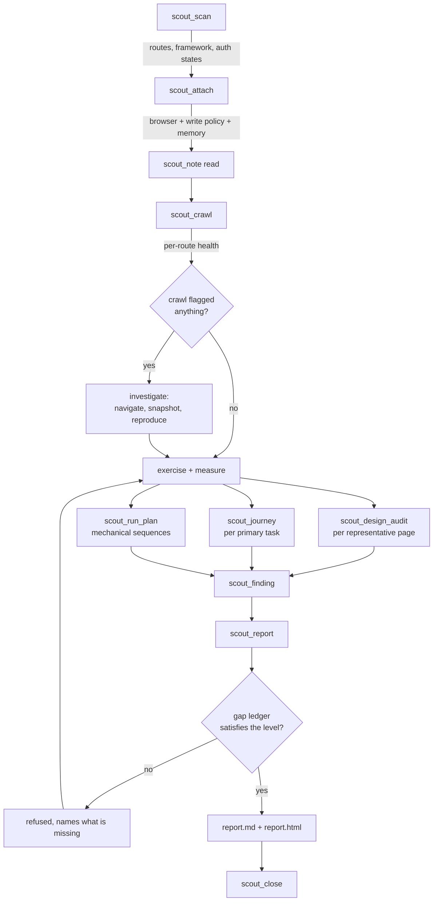
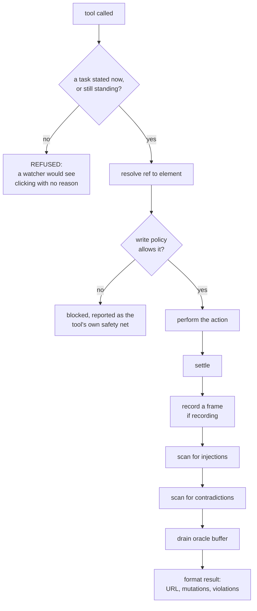
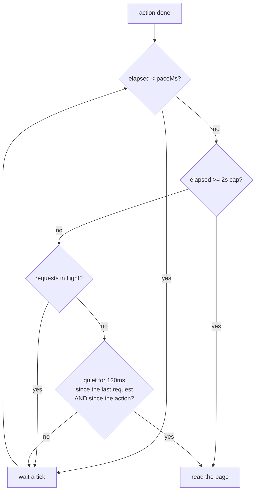
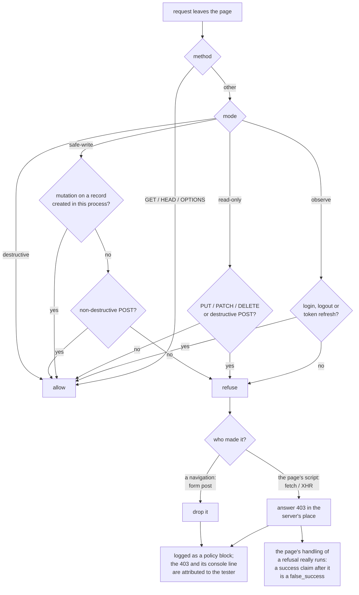
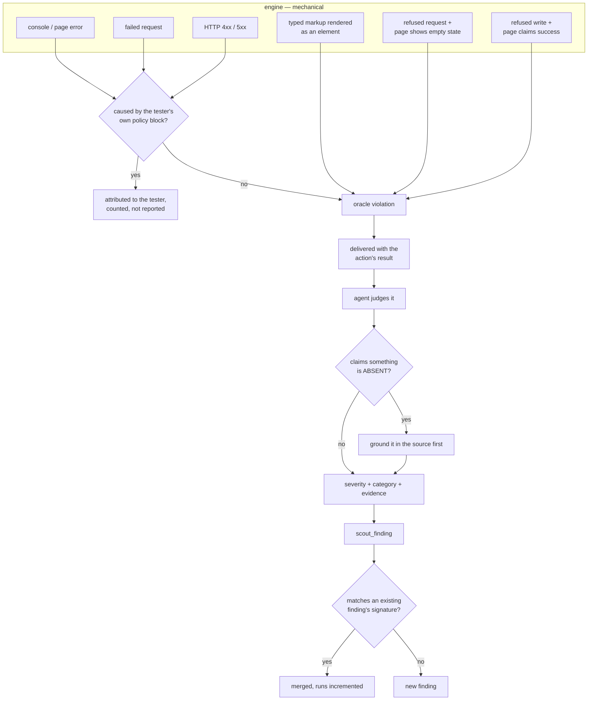
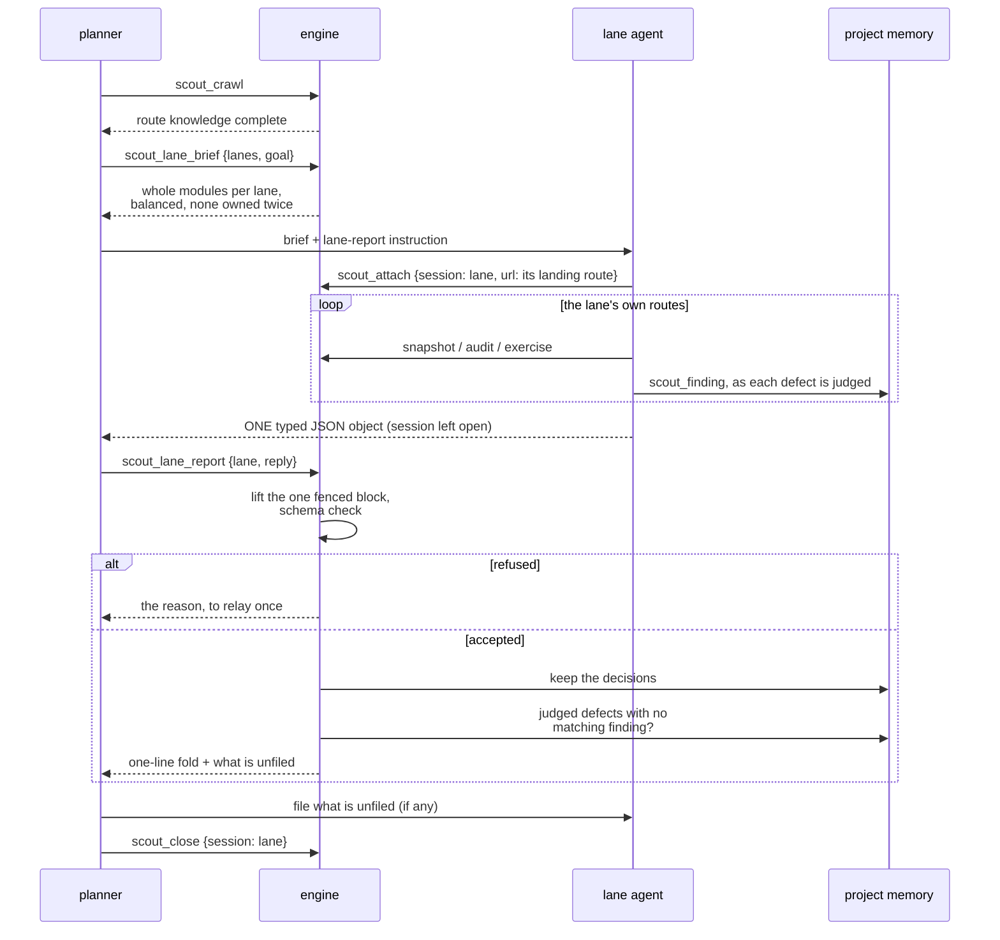
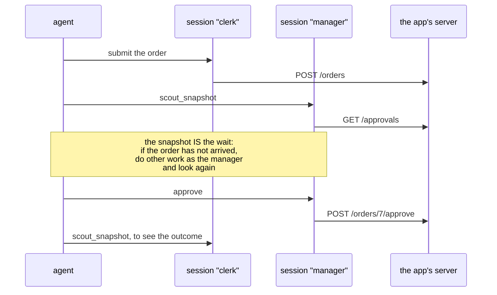
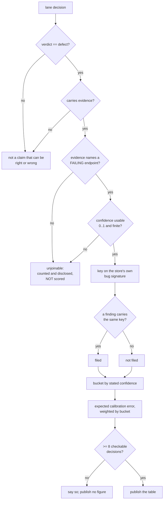
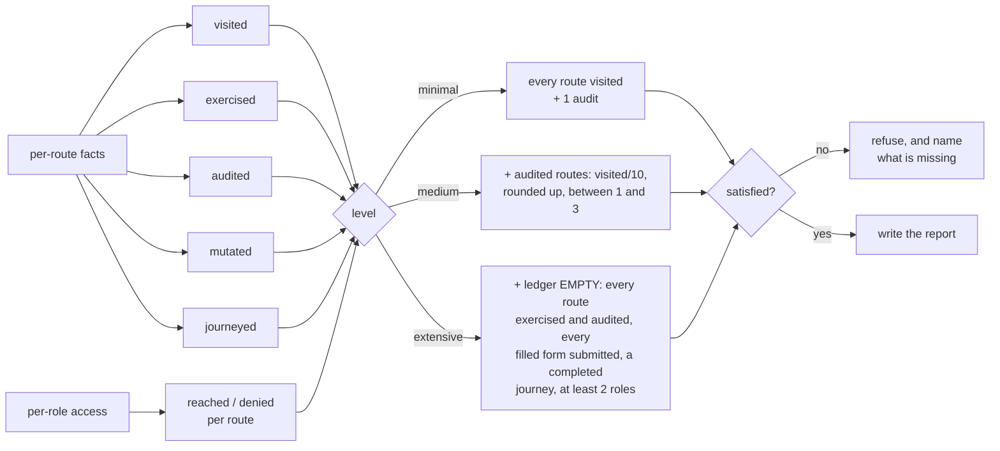

# How SceneScout works, stage by stage

This is the map of what happens during a run and where each decision is made.
It is written for someone changing the engine, not for someone using it — the
user-facing method lives in the skill, and the reasons behind the rules that
cost something live in [the ADRs](adr/).

Two things are worth holding in mind while reading:

- **The engine decides nothing about the app.** It reports render state,
  network facts and rule violations. Whether something is a defect, and how
  bad, is the agent's judgement. Every diagram below has that boundary in it.
- **The engine is not the slow part.** The gap between one action and the next
  is mostly the agent deciding what to do; the engine's own work per action is
  tens of milliseconds plus however long the page takes. Every report measures
  this per session, in its pace section (section 6).

---

## 1. The run, end to end

The loop back from `N` is the point of the whole design: the report refuses
rather than papering over what was not done. See
[ADR 1](adr/0001-completion-is-a-contract-not-a-vibe.md).

---

## 2. Inside one action

Every acting tool — click, type, navigate, select, press, upload — runs the
same pipeline. This is where most of the engine's cleverness lives, and where
the subtle bugs have been.

### Settling: when is the page ready to read?

`waitForLoadState("networkidle")` latches once reached and then resolves
instantly forever, so it cannot be used to wait out the request an action just
fired. A flat sleep was used instead, and cost 54% of a snapshot's wall time.

The quiet window runs from **the action as well as the last request**. A click
that posts to a service worker, which then fetches, makes no request of its
own — reading the page between the two blamed the next action for the worker's
request.

Separately, where a **bounce verdict** is about to be made — attach judging a
storage state, navigate judging coverage — the URL is watched until it holds
still. A client-side auth guard on a timer issues nothing until it fires, so
there is no request to wait on, and the gated route would be recorded as
reached.

---

## 3. The write policy

Enforced on the wire, not in the prompt, because a prompt is advice and a
route handler is a rule ([ADR 2](adr/0002-enforce-the-write-policy-at-the-network-layer.md)).

Two boxes matter. **Attribution:** the stand-in 403, the browser's console line
about it, and a dropped request's network error are all the tool's doing, and
without attribution the safety net is reported as defects of the app.
**Answering rather than dropping:** a dropped `fetch` rejects with a network
error no real server produces, so the page's refusal branch never ran, and a
handler that ignores the response and claims success threw before it could.
The server is not contacted either way
([ADR 9](adr/0009-a-refused-write-is-answered-not-dropped.md)). `scout_request`
meets the same stand-in and says `REFUSED by the write policy` instead of a
status, because a status there is quoted as the server enforcing a rule.

---

## 4. How something becomes a finding

The engine raises *violations*. The agent decides *findings*. The split is
deliberate.

`refused_empty` and `A6`'s `false_success` are the two that pair a precise half
with a fuzzy one: the request half is exact — a status code either is an error
or is not — and the page half is never enough alone. A page that shows an error
raises neither, which is why the false-positive rate stays low enough to report
at high severity.

Dedup is on machine signatures rather than prose, because titles get rephrased
between runs ([ADR 4](adr/0004-dedup-on-machine-signals-not-prose.md)).

---

## 5. A run split across parallel lanes

**Order matters, and it is easy to get wrong.** The decisions are kept against
the lane's own session, so the fold has to happen **before** that session
closes. A lane that closes itself and then reports hands back decisions with
nowhere to write, and the tool says so rather than silently accepting.

**What the lanes share.** Every session on one project shares one store for
the run: the records any session created (so a mutation on a record another
lane made is allowed in safe-write), the markup values any session typed (so a
payload one lane typed on a create form is caught when another lane opens the
list that renders it), and the count of design audits (so the planner's report
is not refused for an audit its lanes ran). None of it is written to disk. The
typed values and the audit count end with the run: when its last session
closes, or moves to another project; ownership lasts until the server process exits, so a record made
earlier in the same process can still be edited.

**Why every lane is told the same thing.** The instruction a lane gets for its
report is byte-identical for every lane except its last sentence, which names
the lane. Built that way, the shared part is one prompt prefix, and a client
that caches prompts pays for it once per wave rather than once per lane. The
schema, the closed sets and every length limit come from the same constants the
parser checks, and a test asserts every limit the parser enforces is stated,
because a limit a lane is not told refuses good replies.

**What a lane may wrap its report in.** One fenced JSON block with prose around
it is accepted, and the prose is discarded unread: six of eight lanes in a
measured run wrapped theirs, and each refusal cost a round trip to recover an
object that was already unambiguous. Unfenced prose, or two fenced objects, is
still refused, because where the report starts is then a guess.

### Roles that hand work to each other

Some flows need two roles: a clerk submits, a manager approves, the clerk sees
the result. There are two ways to run one, and neither involves agents talking
to each other.

- **One agent, two sessions** (the common case). A single agent attaches both
  roles by name and alternates between them. Calls to different sessions run
  concurrently; calls to one session queue, because one browser cannot take
  two actions at once. This is the right shape for a handoff: the agent that
  submitted is the one that knows what to look for next.
- **Separate agents.** Each agent drives its own role, and they coordinate
  through the app itself — the record one creates is what the other sees on its
  next snapshot — and through the shared store, which is why, in safe-write, a
  record the clerk created can be edited or deleted by the manager's session
  (an ordinary POST such as approve passes whoever made the record). There is no message
  channel between agents; the planner sequences them if the order matters.

---

## 6. Where a run's time goes

The pace section of the report keeps two kinds of time apart.

- **While working** — each session's first action to its last. Inside it, the
  median gap between actions is the engine plus the agent deciding, and gaps
  over 30 seconds are the agent thinking at length. Their share of the working
  time is how closely the sessions kept working.
- **After finishing** — the last action to close. The lane is done and holds
  its browser until it is collected; the fold of its report (logged as a
  `lane-report` marker) splits this into still reporting and waiting to be
  closed. This is the planner's cost, not the lanes': it grows with the number
  of lanes and with the slowest one, however well each worked. On the
  benchmark's eight-lane runs it was 18–28 browser-minutes a run, against 0–6%
  idle while working. Closing each lane as soon as its report is folded removes
  it.

Time from attach to the first action is reported too. A session that attached
and never acted used to be missing from the table entirely; it now appears
with all of its time before a first action.

The typed object is what makes the fold cheap: the planner counts rather than
reads, a lane's reply is a few hundred tokens whatever it found, and a value
the schema refuses is caught at the boundary instead of becoming a severity
like "Low-Medium" in the report.

---

## 7. Whether a lane's confidence meant anything

Asking for a calibrated number and never checking it is the half of the idea
that costs nothing and buys nothing. The check joins what a lane *said* to what
the project *filed*.

The `unjoinable` branch is the one that took two review rounds to get right.
Falling back to matching the literal evidence text meant `500 on GET /api/r0` —
ordinary English, and whichever agent wrote the finding chose the word order —
produced a key that matched nothing, and a lane that was **right** about a bug
that **was** filed published an expected calibration error of 0.90.

What the figure is and is not:

- It measures agreement between the lanes and the bar the project applies, over
  its whole history. It is **not** evidence about the app.
- A lane can be perfectly calibrated against a planner that files the wrong
  things.
- A defect filed without a machine signature counts against the lane through no
  fault of its own, and so does one whose signature a merge discarded. Both are
  stated in the section.
- Verdicts from `scout_verify` are reported beside it and flagged as the half
  that **is** about the app.

The benchmark measures the other half. Against an app whose defects are known,
[`npm run bench`](benchmark.md) judges each verdict against an answer key —
not against what the run filed — and reports a Brier score beside the expected
calibration error. Why both numbers exist, and why an unjoinable decision is
disclosed rather than scored, is
[ADR 10](adr/0010-a-confidence-is-checked-not-trusted.md).

---

## 8. What the gap ledger refuses

What the gate enforces is narrower than what each level asks of the agent. The
skill asks a `medium` run to exercise every interactable class and submit each
form valid and invalid, and an `extensive` one to fuzz, walk the keyboard and
the auth surface; the gate checks only what the engine can see for itself,
listed above, and the report's gap ledger discloses the rest.

A ledger entry has to be actionable, and a suppressed one has to be visible, or
the ledger stops being read at all
([ADR 3](adr/0003-a-noisy-ledger-is-a-broken-ledger.md)).

---

## Where each decision lives in the code

Logic that does not need Playwright is kept out of `browser.ts`, because that
is the one file a test cannot reach without launching a browser
([ADR 5](adr/0005-keep-testable-logic-out-of-the-browser-module.md)).

| Stage | Module | Tested by |
|---|---|---|
| Route and element identity | `fingerprint.ts` | `contract-test` |
| When to stop waiting | `settle.ts` | `settle-test` |
| What may leave the page, and what a refused request is told | `policy.ts`, `ownership.ts` | `policy-test`, `smoke/contradiction` |
| Page contradicts the server | `claims.ts` | `claims-test`, `smoke/contradiction` |
| Typed markup coming back as an element | `injection.ts` | `oracle-test`, `smoke/injection` |
| What a lane hands back | `lane.ts` | `lane-test` |
| Whether its confidence held up | `calibration.ts` | `calibration-test` |
| Splitting the app between lanes | `brief.ts` | `brief-test` |
| Re-testing what earlier runs left open | `verify.ts` | `verify-test` |
| How the run spent its time | `pace.ts` | `pace-test` |
| Whether a change made runs better | `bench.ts` | `bench-test` |
| What a lane is told, and what it must file | `brief.ts`, `calibration.ts` (`unfiledDefects`) | `brief-test`, `calibration-test`, `mcp-check` |
| Calling the app's API as the session | `request.ts` | `request-test` |
| The live view's rules | `live.ts` | `live-test` |
