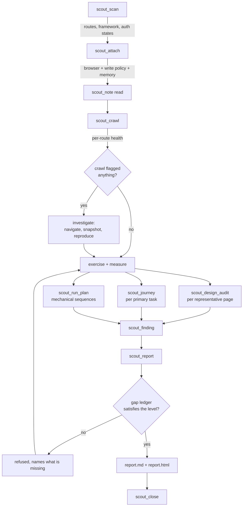
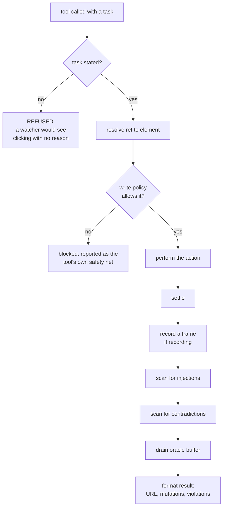
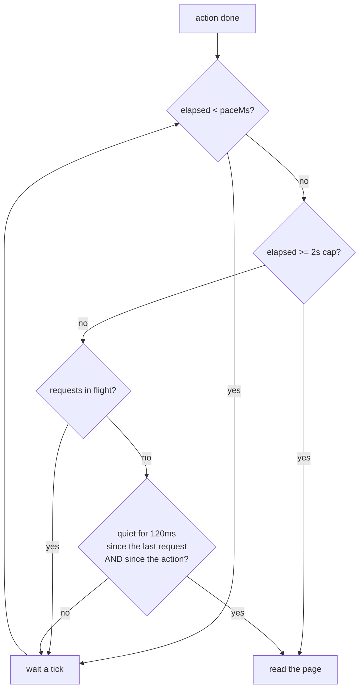
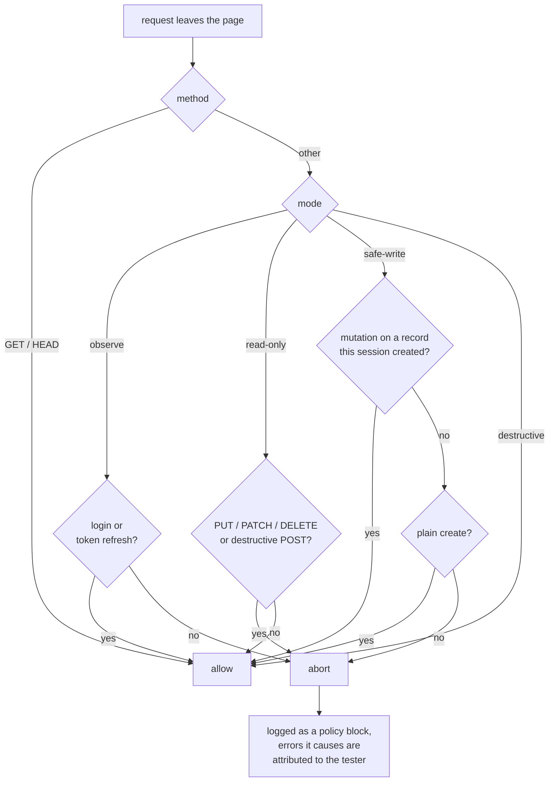
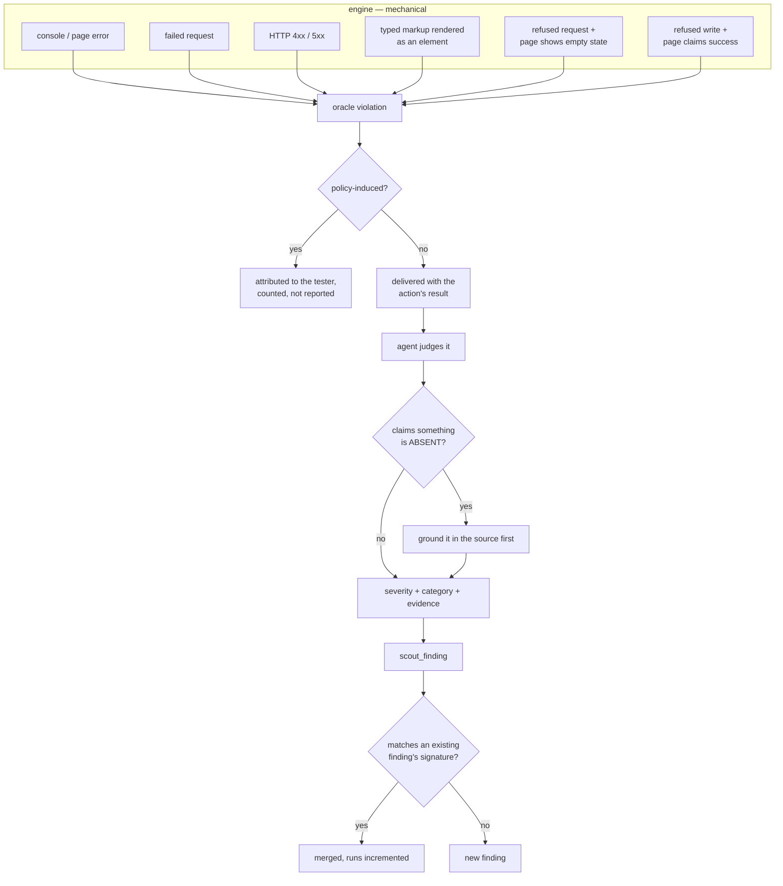
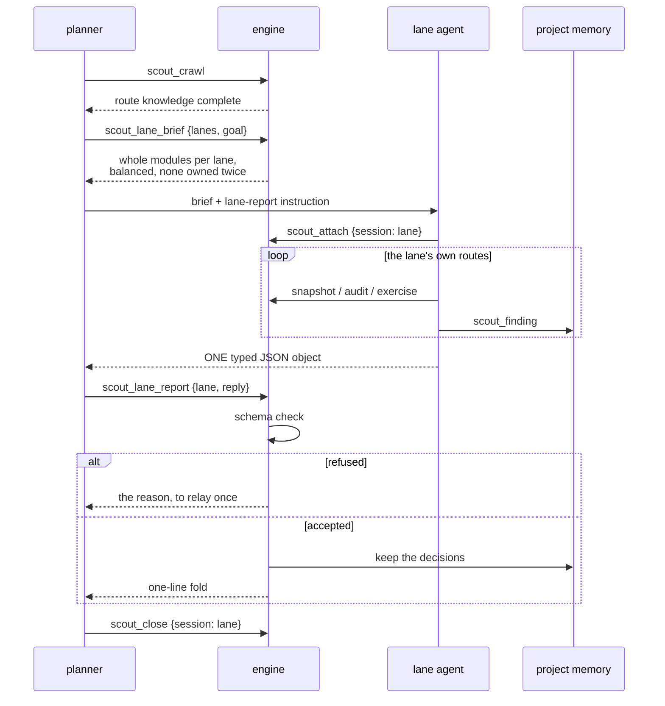
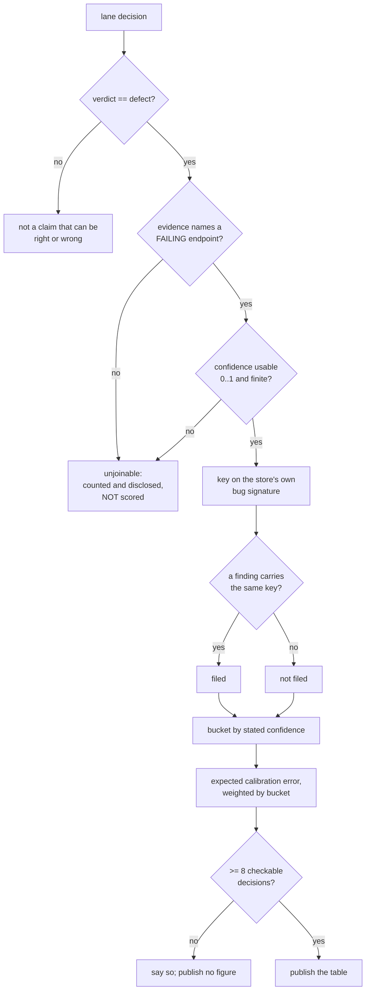
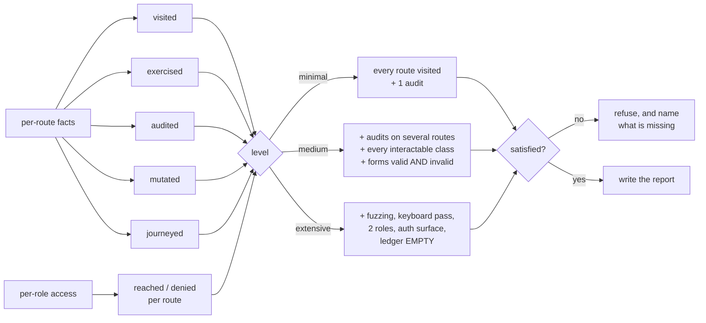

# How SceneScout works, stage by stage

This is the map of what happens during a run and where each decision is made.
It is written for someone changing the engine, not for someone using it — the
user-facing method lives in the skill, and the reasons behind the rules that
cost something live in [the ADRs](adr/).

Two things are worth holding in mind while reading:

- **The engine decides nothing about the app.** It reports render state,
  network facts and rule violations. Whether something is a defect, and how
  bad, is the agent's judgement. Every diagram below has that boundary in it.
- **The engine is not the slow part.** On a measured eight-lane run the median
  gap between one action and the next was 4 seconds, of which about 3 was the
  agent deciding what to do. The engine's own work per action is tens of
  milliseconds plus however long the page takes.

---

## 1. The run, end to end

The loop back from `N` is the point of the whole design: the report refuses
rather than papering over what was not done. See
[ADR 1](adr/0001-completion-is-a-contract-not-a-vibe.md).

---

## 2. Inside one action

Every acting tool — click, type, navigate, select, press, upload — runs the
same pipeline. This is where most of the engine's cleverness lives, and where
the subtle bugs have been.

### Settling: when is the page ready to read?

`waitForLoadState("networkidle")` latches once reached and then resolves
instantly forever, so it cannot be used to wait out the request an action just
fired. A flat sleep was used instead, and cost 54% of a snapshot's wall time.

The quiet window runs from **the action as well as the last request**. A click
that posts to a service worker, which then fetches, makes no request of its
own — reading the page between the two blamed the next action for the worker's
request.

Separately, where a **bounce verdict** is about to be made — attach judging a
storage state, navigate judging coverage — the URL is watched until it holds
still. A client-side auth guard on a timer issues nothing until it fires, so
there is no request to wait on, and the gated route would be recorded as
reached.

---

## 3. The write policy

Enforced on the wire, not in the prompt, because a prompt is advice and a
route handler is a rule ([ADR 2](adr/0002-enforce-the-write-policy-at-the-network-layer.md)).

The last box matters: aborting a request makes the browser print a console
error, and without attribution the tool's own safety net is reported as defects
of the app under test.

---

## 4. How something becomes a finding

The engine raises *violations*. The agent decides *findings*. The split is
deliberate.

`refused_empty` and `A6`'s `false_success` are the two that pair a precise half
with a fuzzy one: the request half is exact — a status code either is an error
or is not — and the page half is never enough alone. A page that shows an error
raises neither, which is why the false-positive rate stays low enough to report
at high severity.

Dedup is on machine signatures rather than prose, because titles get rephrased
between runs ([ADR 4](adr/0004-dedup-on-machine-signals-not-prose.md)).

---

## 5. A run split across parallel lanes

**Order matters, and it is easy to get wrong.** The decisions are kept against
the lane's own session, so the fold has to happen **before** that session
closes. A lane that closes itself and then reports hands back decisions with
nowhere to write, and the tool says so rather than silently accepting.

The typed object is what makes the fold cheap: the planner counts rather than
reads, a lane's reply is a few hundred tokens whatever it found, and a value
the schema refuses is caught at the boundary instead of becoming a severity
like "Low-Medium" in the report.

---

## 6. Whether a lane's confidence meant anything

Asking for a calibrated number and never checking it is the half of the idea
that costs nothing and buys nothing. The check joins what a lane *said* to what
the project *filed*.

The `unjoinable` branch is the one that took two review rounds to get right.
Falling back to matching the literal evidence text meant `500 on GET /api/r0` —
ordinary English, and whichever agent wrote the finding chose the word order —
produced a key that matched nothing, and a lane that was **right** about a bug
that **was** filed published an expected calibration error of 0.90.

What the figure is and is not:

- It measures agreement between the lanes and the bar the project applies, over
  its whole history. It is **not** evidence about the app.
- A lane can be perfectly calibrated against a planner that files the wrong
  things.
- A defect filed without a machine signature counts against the lane through no
  fault of its own, and so does one whose signature a merge discarded. Both are
  stated in the section.
- Verdicts from `scout_verify` are reported beside it and flagged as the half
  that **is** about the app.

---

## 7. What the gap ledger refuses

A ledger entry has to be actionable, and a suppressed one has to be visible, or
the ledger stops being read at all
([ADR 3](adr/0003-a-noisy-ledger-is-a-broken-ledger.md)).

---

## Where each decision lives in the code

Logic that does not need Playwright is kept out of `browser.ts`, because that
is the one file a test cannot reach without launching a browser
([ADR 5](adr/0005-keep-testable-logic-out-of-the-browser-module.md)).

| Stage | Module | Tested by |
|---|---|---|
| Route and element identity | `fingerprint.ts` | `contract-test` |
| When to stop waiting | `settle.ts` | `settle-test` |
| What may leave the page | `policy.ts`, `ownership.ts` | `policy-test` |
| Page contradicts the server | `claims.ts` | `claims-test`, `smoke/contradiction` |
| Typed markup coming back as an element | `injection.ts` | `oracle-test`, `smoke/injection` |
| What a lane hands back | `lane.ts` | `lane-test` |
| Whether its confidence held up | `calibration.ts` | `calibration-test` |
| Splitting the app between lanes | `brief.ts` | `brief-test` |
| Re-testing what earlier runs left open | `verify.ts` | `verify-test` |
| How the run spent its time | `pace.ts` | `pace-test` |
| Calling the app's API as the session | `request.ts` | `request-test` |
| The live view's rules | `live.ts` | `live-test` |
